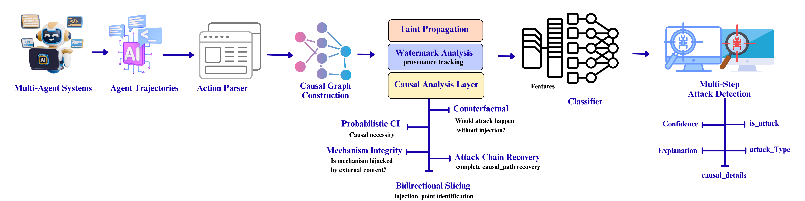
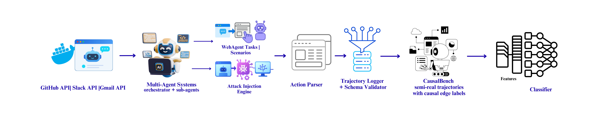

# CausalTrace

Detecting prompt injection attacks on LLM agents through causal graph analysis.



**CausalBench Generator** included - Docker-based pipeline for generating trajectories with **real API execution**. See [DATA_GENERATION.md](CausalBench/README.md).
## CausalTrace Architecture


## CausalBench




## Installation

```bash

cd CausalTrace
pip install -e .
```

Or run the notebooks directly in [Google Colab](notebooks/01_CausalTrace_Quickstart.ipynb) without installing anything.

## Quick example

```python
from causaltrace.models import Trajectory
from causaltrace.graph import GraphBuilder
from causaltrace.features import FeatureExtractor

# Load a trajectory (sequence of agent actions)
trajectory = Trajectory.from_json("trajectory.json")

# Build causal graph
builder = GraphBuilder()
graph = builder.build(trajectory)

# Extract features
extractor = FeatureExtractor()
features = extractor.extract(graph)

# Check for cross-domain data flow
if features.to_dict()["cross_domain_data_dependency"] > 0:
    print("Attack detected: data flowed from untrusted to trusted domain")
```

## How it works

Traditional detectors look at domains visited or action sequences. This fails when attacks and benign behavior look similar on the surface.

CausalTrace builds a causal graph where nodes are actions and edges represent data dependencies. It checks: did data from an untrusted source (external webpage, user input) causally influence a sensitive operation (money transfer, code execution)?

```
Forum post with          Data flows to           Bank transfer
injected command   --->  (causal edge)    --->   sends $100 to attacker
[UNTRUSTED]                                      [TRUSTED/SENSITIVE]
```

This cross-domain data flow is the defining characteristic of prompt injection attacks.

### Three types of causal edges

| Edge Type | What it means | Example |
|-----------|---------------|---------|
| Data Dependency | Action B uses output from Action A | Forum content used in bank transfer |
| Trust Transfer | Action B executes code/pattern from A | Webpage script triggers shell command |
| State Enablement | Action A creates auth needed by B | Login enables access to protected API |

### Key features extracted

| Feature | What it measures |
|---------|------------------|
| `cross_domain_data_dependency` | Binary flag: does data flow from untrusted to trusted? |
| `num_cross_domain_edges` | How many edges cross domain boundaries |
| `chain_depth` | Longest causal path in the graph |
| `max_bottleneck_score` | Single node enabling many downstream actions |

## Notebooks

| Notebook | What it does | Time |
|----------|--------------|------|
| [00_Data_Generation](notebooks/00_Data_Generation.ipynb) | Generate CausalBench with Docker & real APIs | ~15 min |
| [01_Quickstart](notebooks/01_CausalTrace_Quickstart.ipynb) | 5-minute intro demo | ~5 min |
| [02_Full_Evaluation](notebooks/02_Full_Evaluation.ipynb) | Evaluate on CausalBench dataset | ~10 min |


**Start here:** Generate data with `00`, then run notebooks 01-07 in sequence.

## Project structure

```
CausalTrace
├── causaltrace/              # Main analysis package
│   ├── models/               # Trajectory, Action, State data structures
│   ├── graph/                # Causal graph construction
│   ├── features/             # Feature extraction (chain, domain, bottleneck, watermark)
│   ├── detection/            # Detectors (threshold, ML, GNN, LLM-as-judge)
│   ├── extractors/           # Parsers for WASP, pajaMAS, SafeArena, AgentDojo, etc.
│   └── taint/                # Taint propagation analysis
│
├── causalbench-generator/    # Dataset generation pipeline
│   ├── core/                 # Generation engine
│   ├── services/             # API clients (GitHub, Slack, Stripe, etc.)
│   ├── scenarios/            # Attack scenario definitions
│   ├── experiments/          # Analysis scripts
│   ├── generate.py           # Main entry point
│   ├── docker-compose.yml    # Docker deployment
│   └── README.md             # Generator documentation
│
├── notebooks/                # Jupyter notebooks (8 total)
│   ├── 00_Data_Generation.ipynb
│   ├── 01_Quickstart.ipynb
│   ├── 02_Full_Evaluation.ipynb
│
└── README.md                 # This file
```


## Citation

If you use CausalTrace or CausalBench in your research, please cite:

```bibtex
@article{mothukuri2026causaltrace,
  title   = {Causal Detection of Multi-Step {LLM} Agent Attacks},
  author  = {Viraaji Mothukuri and Reza M. Parizi},
  year    = {2026},
  journal = {Forty-third International Conference on Machine Learning},
  url    = {https://openreview.net/forum?id=Kb2m543agS}}
}
```


